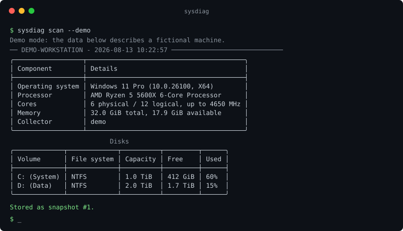
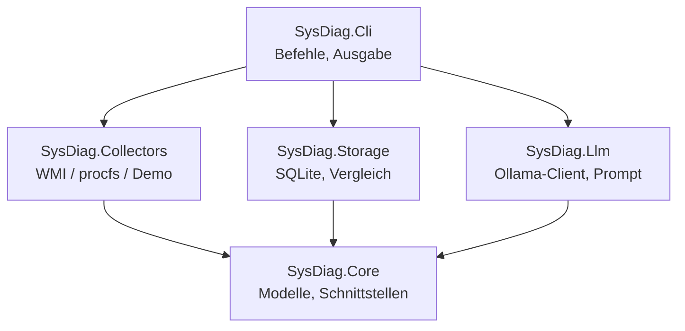

# SysDiag-AI

[](https://github.com/DanillDemydiuk/sysdiag-ai/actions/workflows/ci.yml)
[](https://dotnet.microsoft.com/)
[](LICENSE)



Ein CLI-Werkzeug, das die Konfiguration eines Rechners erfasst, als Snapshot in
einer SQLite-Datei ablegt, zwei Snapshots vergleicht und ein **lokales**
Sprachmodell bitten kann, den Zustand in einfacher Sprache zu erklaeren.

Kein Cloud-Dienst, kein Konto, keine Telemetrie. Das Programm laeuft unter
Windows und Linux und funktioniert auch dann vollstaendig, wenn kein Sprachmodell
installiert ist.

## Warum lokal?

Ein Systembericht enthaelt Seriennummern, Rechnernamen, MAC-Adressen und
Netzwerkinformationen. Solche Daten gehoeren nicht auf einen fremden Server -
weder aus Datenschutzgruenden noch aus Sicht einer IT-Abteilung, die Geraete
inventarisiert.

Deshalb gilt hier:

- Die Datenbank ist eine Datei auf dem eigenen Rechner (`data/sysdiag.db`).
- Das Sprachmodell laeuft in einem lokalen Container (Ollama), erreichbar nur
  ueber `127.0.0.1`.
- MAC- und IP-Adressen werden dem Modell gar nicht erst uebergeben.
- Ohne laufendes Modell arbeitet das Programm normal weiter und gibt einen
  Hinweis aus, statt abzustuerzen.

## Schnellstart

```bash
git clone https://github.com/DanillDemydiuk/sysdiag-ai.git
cd sysdiag-ai
dotnet run --project src/SysDiag.Cli -- scan --demo
dotnet run --project src/SysDiag.Cli -- list
```

Voraussetzung ist ausschliesslich das [.NET 8 SDK](https://dotnet.microsoft.com/download).
`--demo` verwendet eingebaute Beispieldaten: kein Docker, keine
Administratorrechte, identische Ausgabe auf jedem Betriebssystem.

Fuer echte Hardwaredaten den Schalter weglassen:

```bash
dotnet run --project src/SysDiag.Cli -- scan
```

## Befehle

| Befehl | Bedeutung |
| --- | --- |
| `scan [--demo]` | Konfiguration erfassen und als neuen Snapshot speichern |
| `list [--limit n]` | Gespeicherte Snapshots auflisten, neueste zuerst |
| `compare <id1> <id2> [--explain]` | Unterschiede anzeigen, auf Wunsch vom Modell bewerten lassen |
| `explain [id]` | Snapshot vom lokalen Modell erklaeren lassen |
| `export [id] --format json\|markdown [--output datei]` | Snapshot als Datei oder auf die Standardausgabe schreiben |

Beim Vergleich werden Datentraeger und Netzwerkkarten ueber ihren Bezeichner
zugeordnet, nicht ueber ihre Position in der Liste. Werte, die sich von selbst
aendern - freier Arbeitsspeicher, freier Speicherplatz - sind als solche
markiert und zaehlen nicht als Konfigurationsaenderung.

Die beiden Exportformate haben verschiedene Adressaten: JSON liefert rohe
Byte-Werte und feste Schluessel fuer andere Programme, Markdown liefert
gerundete Werte und Tabellen zum Einfuegen in ein Ticket. Netzwerkadressen
stehen nur im JSON - ein Bericht, den man weitergibt, braucht sie nicht.

## Sprachmodell (optional)

```bash
docker compose -f docker/docker-compose.yml up -d
docker exec sysdiag-ollama ollama pull llama3.2:3b
dotnet run --project src/SysDiag.Cli -- explain
```

Details, auch zur GPU-Variante, stehen in [docker/README.md](docker/README.md).

### Welches Modell?

Voreingestellt ist `llama3.2:3b`, weil es mit rund 2 GB auf jedem Rechner ohne
Grafikkarte laeuft. Der Preis dafuer ist die Qualitaet der Erklaerung: im
Vergleich auf derselben Momentaufnahme blieb der Text knapp, liess den fast
belegten Arbeitsspeicher unerwaehnt und rechnete Prozentwerte selbst nach,
statt die vorgegebenen zu uebernehmen.

Wer eine GPU mit etwa 10 GB Speicher oder mehr hat, bekommt mit einem
groesseren Modell deutlich verlaesslichere Ergebnisse. Der Wechsel braucht
keine Codeaenderung - eine Datei `appsettings.local.json` neben der Anwendung
genuegt, sie wird nicht versioniert:

```json
{
  "Ollama": {
    "Model": "qwen2.5:14b"
  }
}
```

Unabhaengig vom Modell gilt: die Tabellen von `scan` und `compare` sind die
belastbare Quelle. Der Modelltext ist eine Lesehilfe, keine Messung.

## Architektur



`SysDiag.Core` enthaelt nur Modelle und Schnittstellen und hat keine einzige
Abhaengigkeit. Alle anderen Projekte zeigen auf `Core`, niemals umgekehrt -
dadurch kennt die Speicherschicht kein WMI und die Sammelschicht kein SQL.

Die Plattform wird zur Laufzeit gewaehlt: `SystemCollectorFactory` liefert
`WindowsCollector` (WMI), `LinuxCollector` (`/proc`, `/sys`) oder - auf einem
nicht unterstuetzten System - den `DemoCollector` samt Hinweis an den Benutzer.

## Konfiguration

`src/SysDiag.Cli/appsettings.json`:

```json
{
  "DatabasePath": "data/sysdiag.db",
  "Ollama": {
    "BaseUrl": "http://localhost:11434",
    "Model": "llama3.2:3b",
    "TimeoutSeconds": 90,
    "ResponseLanguage": "German"
  }
}
```

Eine Datei `appsettings.local.json` im selben Ordner ueberschreibt einzelne
Werte und ist von Git ausgenommen.

## Tests

```bash
dotnet test
```

Geprueft werden die Vergleichslogik samt Randfaellen, das Parsen der
`/proc`-Dateien anhand echter Dateiauszuege sowie der Prompt-Aufbau und das
Verhalten bei nicht erreichbarem Sprachmodell. Kein Test benoetigt Hardware,
Docker oder ein Netzwerk; die Testsuite laeuft in CI unter Ubuntu und Windows.

## In Planung

- `scan --watch`: geplante Snapshots als Windows-Dienst oder systemd-Timer
- Weitere Sammelpunkte: BIOS-Version, installierte Updates, Autostart-Eintraege
- macOS-Collector (aktuell faellt macOS auf den Demo-Modus zurueck, mit Hinweis
  an den Benutzer - geschrieben wird er erst, wenn er auf echter Hardware
  geprueft werden kann)
- Export mehrerer Snapshots am Stueck, etwa fuer eine Inventarliste

## Lizenz

[MIT](LICENSE)
